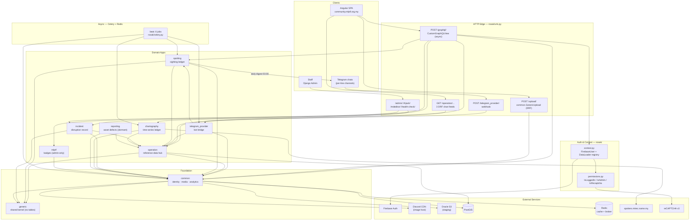

# System Component Registry & Architecture Map

> Compiled from the Phase 1 component docs in [docs/components/](components/). Source of truth for the component list is `INSTALLED_APPS` in [rosak/settings.py](../rosak/settings.py#L67-L111).
>
> **Scope note:** nine of the `INSTALLED_APPS` entries are first-party Django apps in this repo and each has its own Phase 1 doc. The remaining entries (`django.contrib.*`, `hijack`, `strawberry_django`, `health_check.*`, `simple_history`, `cachalot`, `django_celery_*`, `django_cleanup`, `colorfield`, `advanced_filters`, `rangefilter`, `mdeditor`, `ordered_model`, `corsheaders`, `django_extensions`) are third-party packages installed from site-packages; they are catalogued as the **Infrastructure Layer** below rather than given component docs. The `rosak` project package is not an app but _is_ a component — it owns schema assembly, request context, permissions and the beat schedule — so it is included in the catalog.

---

## 🗺️ High-Level System Topology

**The flow in one paragraph.** Every read/write from the SPA lands on a single async GraphQL endpoint. `rosak/context.py` resolves the Firebase bearer token into a `common.User` (lazily `get_or_create`d — there is no signup flow) and attaches a per-request, `deepcopy`'d registry of DataLoaders contributed by four apps. The schema itself is assembled by multiple inheritance in [rosak/schema.py](../rosak/schema.py) — six apps mix `*Scalars` into `Query` and `*Mutations` into `Mutation`, so there is no routing layer to speak of. `operation` is the reference-data hub every other domain app foreign-keys into; `common` is the substrate underneath all of them (identity, media, date-bucketing analytics); `generic` is a table-less shared kernel of GIS and enum primitives. Writes arrive by four distinct paths — GraphQL mutations, the DRF `/upload/` endpoint, the Telegram webhook, and Django admin — and the two most interesting ones are asynchronous: images enter a staged state machine (`TemporaryMedia` → Discord CDN → `Media`) driven by a `post_save` signal, and time-series fleet counts are written only by Celery beat jobs.

### Cross-cutting facts worth holding in context

**Ingress surface** — GraphQL `POST /graphql/` (introspection disabled when `DEBUG=False`); `POST /upload/` (multipart, authenticated by the `Firebase-Auth-Key` header rather than GraphQL context); three DRF chart feeds under `/operation/` (one returns CSV built with `polars`); `POST /telegram_provider/` (self-registering webhook, polling disabled); `/admin/`, `/hijack/`, `/advanced_filters/`, `/mdeditor/`, `/health-check/`; a Sentry tunnel at `/sentry/` and `/version/`. In production, every unmatched path is caught by `custom_view.redirect_view` — a rickroll.

**Celery beat — 6 jobs, all declared centrally in [rosak/celery.py](../rosak/celery.py#L22-L47), none locally:**

| Schedule     | Task                                                                         | Owner               |
| ------------ | ---------------------------------------------------------------------------- | ------------------- |
| every 1 min  | `cleanup_temporary_media_task` — re-drive stalled uploads, purge `TO_DELETE` | `common`            |
| every 10 min | `cleanup_expired_verification_codes`                                         | `common`            |
| 01:00        | `aggregate_line_vehicle_status_mtrec_task` — external scrape                 | `chartography`      |
| 03:00        | `cleanup_telegram_logs` — 30-day retention                                   | `telegram_provider` |
| 03:00        | `report_spotting_today` — per-line Telegram digest                           | `spotting`          |
| 05:00        | `aggregate_line_vehicle_status_mlptf_task` — internal aggregation            | `chartography`      |

**Dependency graph shape.** The app graph is heavily cyclic and only two nodes are clean: `generic` is the sole pure _provider_ (imports nothing first-party) and `reporting` is the sole pure _consumer_ (nothing imports it but `rosak/schema.py`). Real cycles exist between `common`↔`spotting`, `common`↔`incident`, `common`↔`mlptf`, `operation`↔`incident`, `operation`↔`spotting`, `operation`↔`chartography`, and `spotting`↔`telegram_provider`. Most are tolerated via lazy string model references or function-local imports; the one genuine hazard is `common/tasks.py`, which imports `spotting` and `incident` at module top level.

**GraphQL root membership is narrower than `INSTALLED_APPS` suggests.** Six apps are mixed into the root types, but `reporting`'s contributions are entirely commented out and `ChartographyScalars` is an empty type — so the effective root **query** providers are `operation`, `common`, `spotting`, `incident`, and the effective **mutation** providers are `common`, `spotting`, `chartography`. `generic`, `mlptf` and `telegram_provider` have no GraphQL surface at all. `incident`, `operation` and `reporting` expose _no mutations_: their write paths are Django admin and Celery only.

---

## 📚 Component Catalog

| Component Name                                           | Layer/Location                                                                                                                 | Core Responsibility                                                                                                                                                                                                                                                          | Key Dependencies                                                                                                                                                               | Primary Extension Point                                                                                                                                                                                                                                   |
| -------------------------------------------------------- | ------------------------------------------------------------------------------------------------------------------------------ | ---------------------------------------------------------------------------------------------------------------------------------------------------------------------------------------------------------------------------------------------------------------------------- | ------------------------------------------------------------------------------------------------------------------------------------------------------------------------------ | --------------------------------------------------------------------------------------------------------------------------------------------------------------------------------------------------------------------------------------------------------- |
| [**operation**](components/operation.md)                 | Django domain + PostGIS persistence; GraphQL read API + 3 DRF feeds — [operation/](../operation/)                              | Canonical reference data for the physical network: `Line`, `Station`, `StationLine`, `Vehicle`, `VehicleType`, `VehicleLine`, `Asset` (lifts/escalators). The spine every other domain app FKs into. **Read-only over GraphQL.**                                             | `common` (Media, `get_trends`), `incident`, `spotting`, `chartography`, `generic`; `simple_history`, `polars`, `django.contrib.gis`                                            | Ten DataLoaders in `OperationContextLoaders` (add one dict key); pre-written-but-commented `inputs.py` + empty `OperationMutations` are a designed slot for the first write API                                                                           |
| [**common**](components/common.md)                       | Django foundation: persistence + infra adapters + GraphQL slice + DRF upload view + 5 Celery tasks — [common/](../common/)     | The substrate: Firebase-backed `User` identity, `Clearance`/`FeatureFlag` authorization primitives, the entire media ingestion pipeline (`TemporaryMedia` → `Media`), and `get_trends()` — the shared date-bucketing analytics engine                                        | `firebase-admin`, `discord-webhook`, `boto3`/`django-storages`, Pillow+`pillow_heif`, `imgurpython` (deprecating); imports `spotting`/`incident`/`operation`/`mlptf`/`generic` | `FeatureFlag` + `should_upload_media()` runtime kill switch; `TemporaryMediaType` + `TemporaryMedia.metadata` to extend the upload pipeline to new destination models; `ClearanceType` for new capabilities                                               |
| [**spotting**](components/spotting.md)                   | Django domain + PostGIS; GraphQL read/write + 1 Celery task — [spotting/](../spotting/)                                        | The community sighting ledger: a user asserts an `operation.Vehicle` was seen on a date, in a state, at a station pair / depot / GPS point. Everything downstream (fleet charts, "last spotted", digests) derives from it                                                    | `common` (User, Media, `GenericMutationReturn`), `operation` (Vehicle, Station), `generic.WebLocationModel`, `telegram_provider.utils`, `python-telegram-bot`, PostGIS         | `@strawberry_django.filter_field` on `EventFilter` (context-aware filters); `EventSource` + `SpottingDataSource` + its JSON `data` column — the designed seam for new ingestion channels; `SpottingConfig.ready()` for signals                            |
| [**incident**](components/incident.md)                   | Django domain + PostGIS; **read-only** GraphQL — [incident/](../incident/)                                                     | The disruption record, in two structurally disconnected tiers: a per-asset ledger (`VehicleIncident`, `StationIncident`, `is_last` marking current state) and network-level `CalendarIncident` + `CalendarIncidentChronology` spans with markdown detail and `impact_factor` | `operation` (Vehicle/Station FKs, Line/Station/Vehicle M2Ms, filters, scalars), `common.Media`, `generic.GeometricForm`, `ordered_model`, `mdeditor`, `pendulum`               | The abstract triad `IncidentAbstractModel`/`Scalar`/`Filter` — a new incident target is 4 subclasses and no edits; `IncidentMutations` is an empty _already-wired_ class awaiting the first write path; `CalendarIncidentCategory` is data-not-migrations |
| [**chartography**](components/chartography.md)           | Django batch-ingest + GraphQL mutation; Celery write path — [chartography/](../chartography/)                                  | _Chart_-ography, **not** cartography — zero geo fields. An append-only daily time-series ledger of vehicle-status counts per line, ingested from multiple third-party fleet trackers, providing the history the live `operation` models cannot                               | `operation.Line`/`VehicleLine`/`VehicleStatus`, `common.User`, `common.GenericMutationReturn`, `requests`, `rosak.permissions`                                                 | New source = new `DataSources` member + task + beat entry, no model change (`PRASARANA`/`MRFC` are declared-unimplemented slots); `SourceCustomLine` mapping reconciles upstream taxonomies at runtime; empty `ChartographyScalars` awaits root queries   |
| [**telegram_provider**](components/telegram_provider.md) | Django integration/adapter: ASGI-async views + PTB `Application` + 1 Celery task — [telegram_provider/](../telegram_provider/) | The Telegram bridge and the only conversational surface: webhook ingest, raw-payload audit log, 10-command dispatch, argparse-based text→`spotting.Event` conversion, identity linking, digest egress                                                                        | `python-telegram-bot`, `django_asgi_lifespan`, `httpx`, DRF; writes `spotting.Event`, updates `common.User.telegram_id`, reads `operation.Line`/`Vehicle`                      | `handlers_dict` in `apps.py` — one dict entry auto-drives registration, `/help` text and Telegram menu sync; `spotting_parser()` for new grammar; `add_handlers` accepts `MessageHandler`/`CallbackQueryHandler` today with no schema change              |
| [**generic**](components/generic.md)                     | Table-less shared kernel spanning ORM + admin + GraphQL primitives — [generic/](../generic/)                                   | One definition of the cross-cutting primitives: `WebLocationModel` (abstract GIS), `GeometricForm` (lat/long admin widget), `JsonPrettifyAdminMixin`, `DateGroupings` enum, `WebLocationInput`, and five GeoDjango↔GraphQL scalars. **Contributes zero migrations.**         | `django.contrib.gis`, `strawberry`, `pygments`. Imports no first-party app — the only pure leaf-provider                                                                       | Abstract-model and admin-form inheritance (5 apps already do it); `generic/schema/scalars.py` as the home for new geo scalars — `GeoLineString`/`GeoPolygon`/`GeoLinearRing`/`GeoMultiPoint` are defined and wired to nothing                             |
| [**reporting**](components/reporting.md)                 | Django domain + GraphQL scaffolding — [reporting/](../reporting/)                                                              | Crowd-sourced defect reports against station assets (escalators/lifts), and the only triage workflow in the repo: `Report` + `Vote` corroboration + `Resolution` closure. **Dormant** — models/admin live, entire GraphQL surface commented out, one migration since 2022-07 | `operation.Asset`, `common.User`/`Media` (lazy refs), `django-model-utils` (`SoftDeletableModel`, `UUIDModel`)                                                                 | Uncommenting: the root `Query`/`Mutation` already inherit its stubs, so re-enabling needs no `rosak/schema.py` change; `ReportType` widens additively; through-models `ReportMedia`/`ReportResolution` carry per-link metadata                            |
| [**mlptf**](components/mlptf.md)                         | Django persistence + admin only — [mlptf/](../mlptf/)                                                                          | Community **badges** only — `Badge` + `UserBadge` through-model. Despite the org name it models no membership, chapters or roles (identity lives in `common.User`, authz in `common.Clearance`). No views, urls, schema, tasks or signals                                    | `common.User` (FK + M2M), `django-model-utils`. On `common`'s **migration critical path** via `common/migrations/0002_user_badges.py`                                          | `UserBadgeStackedInline` (already reused by `common.admin.UserAdmin`); `UserBadge` as explicit through-model for `awarded_by`/`reason`/`revoked`. Otherwise thin — a consumer-facing badge feature starts with net-new plumbing                           |
| **rosak** _(project, not an app)_                        | Composition root — [rosak/](../rosak/)                                                                                         | Schema assembly by multiple inheritance, per-request GraphQL context (`FirebaseUser` + DataLoader registry), the three Strawberry permission classes, the central beat schedule, Sentry tunnel, settings                                                                     | All schema-bearing apps; `strawberry`, `django_asgi_lifespan`, `sentry_sdk`, `dotmap`                                                                                          | `ContextLoaders` dict (one key per app); `permissions.py` for new `BasePermission` classes; `beat_schedule` for new periodic work (`autodiscover_tasks()` means new `tasks.py` files need no registration)                                                |

### Infrastructure Layer (third-party `INSTALLED_APPS`, not analyzed individually)

| Concern         | Packages                                                                                                  | Notes                                                                                                                                                                                                                                                                                 |
| --------------- | --------------------------------------------------------------------------------------------------------- | ------------------------------------------------------------------------------------------------------------------------------------------------------------------------------------------------------------------------------------------------------------------------------------- |
| GraphQL         | `strawberry_django` 0.82.1                                                                                | **Migrated August 2026** from `UNSET` to `strawberry.Maybe[T]` pattern (strawberry-graphql 0.323.2); `DjangoOptimizerExtension` always on; `NoSchemaIntrospectionCustomRule` added when `DEBUG=False`; see [STRAWBERRY_MIGRATION.md](STRAWBERRY_MIGRATION.md) for tri-state semantics |
| Caching         | `cachalot`, `django.middleware.cache.*`                                                                   | Redis-backed with `ENVIRONMENT` key prefix; **`DummyCache` when `DEBUG=True`**                                                                                                                                                                                                        |
| Async tasks     | `django_celery_beat`, `django_celery_results`                                                             | Results in `django-db`; a separate `celery` DB cache alias                                                                                                                                                                                                                            |
| Audit / history | `simple_history`                                                                                          | Only on `operation.Vehicle` and `operation.Asset` — a queryable trail nothing currently exposes                                                                                                                                                                                       |
| Admin UX        | `hijack`, `advanced_filters`, `rangefilter`, `colorfield`, `ordered_model`, `mdeditor`                    | Admin is a first-class write path here, not an afterthought                                                                                                                                                                                                                           |
| Ops             | `health_check` (+db/cache/storage/migrations/celery_ping/psutil/redis), `sentry_sdk`, `django_extensions` | `/health-check/` covers broker and disk/memory                                                                                                                                                                                                                                        |
| Files           | `django_cleanup` (must stay last), `django-storages`/`boto3`                                              | Default storage is Oracle S3-compatible                                                                                                                                                                                                                                               |

---

## 💡 Potential Feature Opportunities

Non-AI features — ordinary engineering and product work. Each of the nine component docs carries its own `## 💡 Potential Feature Opportunities` section with 5 items, each tagged `Ready` / `Partially ready` / `Not ready` and, where not ready, the exact blocker and the files to touch. **45 items total: 10 ready, 22 partially ready, 13 not ready.** This section indexes them, then adds the cross-cutting features that no single component doc could see. (The `🎯` section below covers the AI-flavoured cross-cutting set.)

### Readiness index

**Ready now — no blockers** (10)

| Component                                            | Feature                                                                                           |
| ---------------------------------------------------- | ------------------------------------------------------------------------------------------------- |
| [operation](components/operation.md)                 | Collapse the seven hand-written `vehicle_status_*_count` fields into one generated `statusCounts` |
| [common](components/common.md)                       | Filterable media gallery with back-links to the entry each photo documents                        |
| [common](components/common.md)                       | A real platform-wide feature-flag surface                                                         |
| [spotting](components/spotting.md)                   | Per-user read/unread inbox for sightings                                                          |
| [incident](components/incident.md)                   | Put asset-level incidents on the map, with their photo evidence                                   |
| [chartography](components/chartography.md)           | Give `chartography` a first-class GraphQL read surface                                            |
| [chartography](components/chartography.md)           | Honour `force` so a bad ingest run can be repaired                                                |
| [telegram_provider](components/telegram_provider.md) | Chat-scoped, indexed spotting provenance                                                          |
| [generic](components/generic.md)                     | A typed, shared point-and-radius search input                                                     |
| [generic](components/generic.md)                     | A `GeometricForm` that is safe to reuse, unblocking further GIS admin screens                     |

**Partially ready — a named blocker stands in the way** (22)

- **operation** — station accessibility board ("which lifts work here"); fleet/asset change timeline from `HistoricalRecords`; staff-authenticated GraphQL write API
- **common** — finish the Imgur retirement and delete the subsystem; upload receipts + dead-letter queue for failed conversions
- **spotting** — an `editEvent` mutation with the contribution window expressed once; moderation queue for fleet-contradicting sightings; contributor leaderboards, streaks and "sets you have never spotted"
- **incident** — per-line reliability score from `impact_factor`; public status page + subscribable ICS/Atom/RSS disruption feed
- **chartography** — admin-editable source-to-line reconciliation (delete the hardcoded PK map); deterministic side-by-side source comparison
- **telegram_provider** — deterministic station-location capture typed at the constraint level; tap-to-confirm disambiguation; outbound delivery audit trail on one governed egress path
- **generic** — route/service-area geometry for `operation.Line`; validation parity between the GraphQL and admin ingestion paths
- **reporting** — ship the drafted submission/browse surface; one vote per person, withdrawable; "is the lift working right now?" on the station page
- **mlptf** — deterministic rule-based badge awarding as a nightly Celery task; scheduled/seasonal badge reveals using `Badge.released`

**Not ready — good idea, needs schema or plumbing first** (13)

- **operation** — route-ordered station sequences (strip maps, "next stations"): `StationLine` has no ordinal field and `Meta.ordering` sorts lexicographically
- **common** — content-hash de-duplication and duplicate-safe join rows: needs a `content_hash` column plus a re-download backfill
- **spotting** — map view of sightings, GPS on every event type: `LocationEvent` is an FK not a `OneToOne`, and the check constraint never requires coordinates for `type=LOCATION`
- **incident** — "all incidents in this disruption" (one FK to join the two tiers); station incident history (blocked by the missing `condition=Q(is_last=True)`)
- **chartography** — date-ranged backfill and replay tooling: neither task has replayable history, so backfill would fabricate data without a raw-payload archive first
- **telegram_provider** — clearance-gated commands and self-serve channel binding with `/status`
- **generic** — `QUARTER` / `HOUR` members for `DateGroupings` (see cross-cutting item 3 — the existing branches are broken)
- **reporting** — explicit report status lifecycle + orderable open-fault feed; photo evidence on a report (no `REPORTING_*` member in `common.TemporaryMediaType`)
- **mlptf** — read-only badge exposure on the user graph; badge rarity and holder listings; badge sprites in the project's own media pipeline

### Cross-cutting features (span components; not visible from any single doc)

**1. Fix `DateGroupings` and every trend surface unlocks at once** _(generic + common + operation + chartography)_ — **do this first**

The smallest change in this document with the widest blast radius. `common.utils.get_default_start_time()` assigns to `date.month` / `date.day` on an immutable `datetime.date`, so the `YEAR`, `MONTH` and `WEEK` branches all raise `AttributeError` — **only `DAY` works**, which is precisely why every caller (`common/schema/scalars.py`, `operation/schema/scalars.py` ×2, `common/utils.py`) hardcodes `DateGroupings.DAY` as its default. `DateGroupings` is the single bucketing vocabulary shared by `operation`'s trend resolvers, `common.medias_group_by_period`, `UserScalar.spotting_trends` and the DRF chart feeds, so three lines of `date.replace(...)` restore monthly, weekly and yearly analytics across four apps simultaneously — and only then do `QUARTER`/`HOUR` become worth adding.
**Readiness:** `Ready` — three lines in `common/utils.py`. `common/tests.py` and `generic/tests.py` are both 0 bytes, so add coverage in the same pass; this helper is depended on by five apps with zero tests.

**2. A rider-facing station page: accessibility, live faults and incidents in one query** _(operation + reporting + incident)_

Three apps each hold one third of "what is broken at this station right now" and none of them can answer it. `operation.Asset` carries `status` and `asset_type` for lifts and escalators; `reporting.Report` already FKs to `operation.Asset` with community voting and resolution; `incident.StationIncident` holds the editorial record with a real `PointField`. This is the most valuable unbuilt rider feature in the repo and the highest-value reason to un-park `reporting`.
**Readiness:** `Partially ready` — three small, independent blockers: `Asset.status` is absent from both the `Asset` scalar and `AssetFilter` (and uses plain `choices=` rather than `TextChoicesField`, so it would not render as a GraphQL enum); `reporting` has no `loaders.py` and no `"reporting"` key in `rosak/context.py`; and an `operation → reporting` import would add a new cycle per `tach.yml`, so the join belongs on the `reporting` side or behind a DataLoader.

**3. One governed egress path for all outbound messaging** _(telegram_provider + spotting + incident + mlptf)_

Outbound Telegram is currently ungoverned: `spotting.tasks.report_spotting_today` constructs its **own** `telegram.Bot` outside `telegram_provider`'s PTB application and its managed `httpx` client, `MessageDirection.OUTBOUND` is defined and never written, `error_handler` only `print`s while `TELEGRAM_ADMIN_CHAT_ID` sits unused, and `infinite_retry_on_error` retries unbounded with 10s sleeps. One owner — with delivery logged, bounded retry, and shared rate limiting — is a reliability feature in its own right _and_ the precondition for badge announcements (mlptf item 2), incident alerts, and per-user digests (item 4 below).
**Readiness:** `Partially ready` — the blocker is `spotting/tasks.py`'s independent `Bot`; the send helper must move into `telegram_provider` and be imported back, which the two-way `spotting`↔`telegram_provider` cycle already permits.

**4. Per-user subscriptions instead of one blanket channel dump** _(spotting + common + telegram_provider)_

`report_spotting_today` posts one digest per line channel at 03:00 with no per-user concept, yet the per-user machinery already exists and is half-wired: `EventRead`, `EventScalar.is_read` and `EventFilter.is_read` are all user-scoped and `IsLoggedIn`, while the `markAsRead` mutation that writes them is gated `IsAdmin` — so read state is fully built and unreachable by the users it describes. `common.User.telegram_id` gives the delivery address and `common.Clearance` gives the capability model.
**Readiness:** Ungating `markAsRead` is `Ready` and is the cheapest real feature on this list. A preferences model (which lines, which vehicle types, what hour) is `Not ready` — new model plus migration, and it should land after item 3 so delivery is auditable.

**5. Shared geo primitives give three apps "near me" at once** _(generic + operation + spotting + incident)_

`operation.StationFilter.location` is the only proximity filter in the codebase and types its argument as untyped `strawberry.scalars.JSON`, so omitting `radius` reaches `Distance(km=None)`. Meanwhile `spotting.LocationEvent` and `incident.IncidentAbstractModel` both carry `PointField`s and expose **no** geo filtering at all. Promoting `generic/types.py`'s dead `Point2D_SearchField` TypedDicts into a real `@strawberry.input` plus a shared `Q`-builder makes one app's ad-hoc filter a platform capability.
**Readiness:** `Ready` for the point-radius input. The route-geometry extension is `Partially ready` and gated on one rename: `GeoMultiPoint` is declared as `NewType("GeoLineString", ...)` in `generic/schema/scalars.py`, so schema construction would fail with a duplicate-type-name error the moment both scalars are referenced.

---

## 🎯 Cross-Component Feature Opportunities

### 1. Operator announcement → auto-drafted `CalendarIncident` _(telegram_provider + incident + operation)_

The single largest missing edge in the dependency graph: `telegram_provider` ingests operator channel messages and **never touches `incident`**, so every disruption record is hand-typed in admin. Every piece needed already exists — `TelegramLogs.payload` retains the full raw JSON (30-day window), `operation.Line.telegram_channel_id` gives channel→line routing, `IncidentMutations` is an empty class _already mixed into the root schema_, `CalendarIncidentChronology.source_url` provides citation, and `inaccurate=True` is a purpose-built "unverified, awaiting review" flag. An extraction step proposing `(start_datetime, end_datetime, severity, lines[], title, brief)` plus successive chronology rows turns a manual editorial task into a review queue. **Highest value, moderate friction** — the only new plumbing is a `MessageHandler` (the dispatcher currently registers `CommandHandler`s only) and the first `incident` mutation.

### 2. Restore and upgrade the media moderation gate _(common + spotting + incident)_ — **low-hanging fruit**

The NSFW check is commented out in `common/signals.py`, leaving `check_temporary_media_nsfw` orphaned and **every upload converting unchecked** straight to the Discord CDN. The entire scaffold survives intact: status transitions through `TemporaryMediaStatus`, a configurable threshold, `metadata["nsfw_probability"]`, an `OVERRIDE_CLEARED` human-review escape hatch, `TRUSTED_MEDIA_UPLOADER` short-circuiting, and a 1-minute beat job that re-drives stalled rows. Re-enabling is a few lines. The upgrade — swapping one binary RapidAPI score for structured multimodal output (safety, is-this-actually-a-train, blur/duplicate, plate/face PII) plus captions and alt-text written into the same JSON field — needs **no migration**, and immediately gives the currently-disabled `MediaFilter` in `common/schema/filters.py` something worth filtering on.

### 3. Wire `impact_factor` into a per-line reliability index _(incident + chartography + operation)_

`CalendarIncident.impact_factor` is fully wired — column, admin field, GraphQL field, ordering key — with a `help_text` specifying "scores to deduct from a full score of 100 per day, prorated by usual service hours" and **zero consumers anywhere in the repo**. Meanwhile `chartography` is a provider-agnostic, append-only `Snapshot` → `*CountHistory` ledger explicitly shaped to take additional metric families, and `operation` already serves per-line daily series over DRF. Joining incident spans to fleet-status history yields the reliability metric the column was specified for, plus assisted `impact_factor` suggestion at admin-save time from span duration, affected-line count and chronology length. **Low friction** — one new metric table following an existing shape, no changes to `incident`.

### 4. Close the contribution loop: badges + digests _(mlptf + spotting + common + telegram_provider)_ — **low-hanging fruit**

`mlptf` is currently a **write-only admin table**: badges are unreachable from GraphQL even transitively through the user graph, and awarding is entirely manual, even though the adjacent apps hold exactly the signals you would award on. Everything for the read side already exists — `common.UserScalar` computes `favourite_vehicles`, `with_most_entries`, `spottings_count` and `spotting_trends`; `UserBadge` is an explicit through-model ready for `awarded_by`/`reason`; `telegram_provider` is a live per-user notification channel; `report_spotting_today` is a working template for a nightly job. A rules-or-model eligibility task writing `UserBadge` rows, badges exposed on `UserScalar`, and "two more sightings on this line completes X" nudges in-channel is a complete engagement loop for one small app plus one resolver. Prerequisites called out in the component doc: `__str__`, `Meta.ordering`, and a `UniqueConstraint` on `UserBadge(user, badge)`.

### 5. Natural-language query and capture layer _(generic + operation + spotting + incident + chartography)_

The read side is unusually well-prepared for a text-to-query layer because the _constrained output targets already exist_: `StationFilter.location` takes a point-plus-radius, `EventFilter.free_search` spans notes/stations/vehicle identifiers, `DateGroupings` is a small closed enum every analytics resolver in `common` and `operation` already speaks, and the filter graph is fully nested. Translating "lifts out of service within 2 km of KL Sentral last monsoon" into a nested filter argument tree needs **no new resolvers** — only a translation step in front of the existing schema. The write-side counterpart is the strongest structural invitation in the repo: `spotting_parser()` is a real `argparse.ArgumentParser`, so free text can be converted to an argv vector and then **re-validated through the deterministic grammar**, keeping argparse the sole writer while accepting messy human phrasing. `TelegramLogs.payload` paired with `TelegramSpottingEventLog` is already a labelled corpus of (message → resulting Event).

### Missing system components that should be built next

1. **A unified notification/egress service.** Telegram egress is duplicated and inconsistent: `spotting.tasks.report_spotting_today` instantiates its own standalone `telegram.Bot` _outside_ `telegram_provider`'s PTB application and its managed `httpx` client, `TelegramLogs.direction` has an `OUTBOUND` member that is never written, and `error_handler` merely `print`s while `TELEGRAM_ADMIN_CHAT_ID` sits unused. One owner for outbound messaging — with the existing audit log actually recording sends — is a precondition for items 1, 3 and 4 above.
2. **Any test infrastructure at all.** `tests.py` is empty in `common`, `generic`, `mlptf`, `operation` and `spotting`; `spotting`, `incident`, `chartography` and `telegram_provider` have no test module for their tasks or handlers. `generic` in particular is depended on by five apps with zero coverage. This is the main friction against every other item on this list.
3. **Ingest-health monitoring.** Nothing notices when MTREC silently changes its JSON shape — the scrape maps hardcoded numeric `Line` PKs and guards unknown upstream codes with a bare `assert` (stripped under `python -O`). A day-over-day plausibility check on `LineVehicleStatusCountHistory` doubles as anomaly detection for riders and as a canary for the scraper.
4. **A moderation/triage console.** Three separate queues already exist in data but have no operator surface: `EventFilter.different_status_than_vehicle` (sightings contradicting the fleet record), `TemporaryMediaStatus.OVERRIDE_CLEARED` (manual media review), and `reporting`'s soft-delete + vote tables. One staff-only GraphQL slice over the unfiltered managers would surface all three with no schema change.
5. **A decision on `reporting`.** It is the only app modelling a triage lifecycle, it is a clean import-leaf (near-zero blast radius), and it has been parked since July 2022. Either re-enable it — fixing `ReportFilter.filter_types` (filters `report_type__in`, field is `type`) and adding a `UniqueConstraint` on `Vote(report, user)` first — or retire it. Leaving five models and a commented-out schema in place is the worst of the three options.

---

## ⚠️ Known Defects & Traps

Surfaced by the component audits — the first block by the Phase 1 pass, the rest while grounding the feature-opportunity sections above. Recorded here because each one will bite anyone building on these components, and several are the named blockers behind a `Partially ready` / `Not ready` verdict. Roughly ordered by likelihood of causing visible harm.

| Component                        | Issue                                                                                                                                                                                                                                                                                                                                   |
| -------------------------------- | --------------------------------------------------------------------------------------------------------------------------------------------------------------------------------------------------------------------------------------------------------------------------------------------------------------------------------------- |
| `common`                         | NSFW moderation call commented out in `signals.py` — all uploads convert unchecked                                                                                                                                                                                                                                                      |
| `incident`                       | `StationIncident`'s `UniqueConstraint` omits the `condition=Q(is_last=True)` its `VehicleIncident` twin has → a station can hold only **one** historical incident before `IntegrityError`                                                                                                                                               |
| `incident` / `operation`         | `CalendarIncident.lines` and `operation.Line.calendar_incidents` are **two separate join tables**; admin edits the former, GraphQL `Line.calendarIncidents` reads the latter — so that field is expected to be permanently empty                                                                                                        |
| `spotting` / `telegram_provider` | `get_daily_updates()` overwrites its `spotting_date` argument with `date.today()`, so the 03:00 digest's "yesterday" intent is silently ignored                                                                                                                                                                                         |
| `common`                         | `get_default_start_time()` assigns to read-only `date.month`/`date.day`, so the YEAR/MONTH/WEEK branches **all** raise `AttributeError` — only `DAY` works, which is why every caller hardcodes `DateGroupings.DAY`. Effectively the platform has no monthly/weekly/yearly analytics                                                    |
| `common`                         | `common/tasks.py` still writes `Media.file` through `ImgurStorage._save` on **every** upload — the "deprecating" Imgur path is on the live hot path, not dormant                                                                                                                                                                        |
| `common`                         | `TemporaryMediaAdmin.prettified_metadata` raises `AttributeError`: the class omits `generic.admin.JsonPrettifyAdminMixin`. `TemporaryMediaStatus.RETRY_ELAPSED` is assigned nowhere                                                                                                                                                     |
| `spotting`                       | `markAsRead` is gated `IsAdmin` while `EventScalar.is_read` / `EventFilter.is_read` are user-scoped and `IsLoggedIn` — per-user read state is fully built and unreachable by users                                                                                                                                                      |
| `spotting`                       | `eventsCount` is an unfiltered `Event.objects.acount()` and ignores `EventFilter`, so any paginated UI shows a wrong total. `UserScalar.with_most_entries` raises `IndexError` for a user with zero events                                                                                                                              |
| `spotting`                       | The `spotting_event_value_relevant` `CheckConstraint` never requires coordinates for `type=LOCATION`, so a location-type event can be saved with no location                                                                                                                                                                            |
| `operation`                      | `operation/schema/inputs.py` imports a non-existent `operation.schema.enums`, so the commented write API cannot simply be uncommented; `StationInput.internal_representation` is a `StationLine` field, and no `VehicleInput` exists                                                                                                    |
| `operation`                      | `StationLine` has no ordinal field and `Meta.ordering` sorts lexicographically on `internal_representation` — station sequences render out of route order                                                                                                                                                                               |
| `telegram_provider`              | `handlers.spot` matches `telegram_log__payload__message__message_id` with **no chat filter** (unlike `/delete`), so spotting provenance can bind to another chat's message of the same id                                                                                                                                               |
| `chartography`                   | `SourceCustomLine.mapped_lines` uses an explicit `through`, so Django omits it from the admin form; `SourceCustomLineLineMapping` is unregistered and `SourceCustomLineAdmin` has no inline — the "admin-editable mapping" escape hatch is currently **unreachable**. The MTREC task also accepts neither `force` nor `triggered_by_id` |
| `reporting`                      | `reporting/schema/enums.py` is imported by the commented filters and inputs but **does not exist**. `Report.type` is a plain `TextField(choices=...)`, so `strawberry.auto` would render it as `String`, not the `ReportType` enum                                                                                                      |
| `generic`                        | `GeometricForm.required` is dead code — `latitude`/`longitude` are built in the parent class body while `required` is still `None`. `incident` sets `Meta.widgets` to hide `location` while `spotting`/`operation` comment it out, so rendering depends on import order                                                                 |
| `operation`                      | `spotting_count_from_vehicle_loader` aliases its SQL aggregate on `key[0]` only while keys are `(vehicle_id, Q)` — two different date windows for one vehicle collide within a request                                                                                                                                                  |
| `reporting`                      | `ReportFilter.filter_types` filters `report_type__in`; the model field is `type`. No `UniqueConstraint` on `Vote(report, user)` → ballot stuffing                                                                                                                                                                                       |
| `generic`                        | `GeoMultiPoint` declared as `NewType("GeoLineString", ...)` — duplicate GraphQL type name, latent only because neither scalar is used                                                                                                                                                                                                   |
| `generic`                        | `GeometricForm` subclasses mutate the **parent's** shared `Meta`, i.e. order-dependent global state across three apps                                                                                                                                                                                                                   |
| `telegram_provider`              | `views.py` binds `ptb_application` at import time, capturing `None` before lifespan startup rebinds it; under WSGI the bot never initialises at all                                                                                                                                                                                     |
| `telegram_provider`              | `infinite_retry_on_error` retries unbounded with 10s sleeps — can pin a worker indefinitely                                                                                                                                                                                                                                             |
| `chartography`                   | `force` accepted by mutation and task but never read; MTREC map hardcodes numeric `Line` PKs; `Snapshot.date` is a `DateField` fed a datetime                                                                                                                                                                                           |
| `incident`                       | `CalendarIncidentFilter.date` guards range width with a bare `assert` (500, not a validation error; stripped under `-O`) and has a `month__lte = value + 1` off-by-one assuming 0-indexed JS months                                                                                                                                     |
| `incident`                       | `CalendarIncidentScalar.last_updated` re-fetches its row plus two chronology queries **per node**, invisible to the optimizer — the app's N+1 hotspot                                                                                                                                                                                   |
| `mlptf`                          | No `UniqueConstraint` on `UserBadge(user, badge)`; no `__str__` on either model                                                                                                                                                                                                                                                         |
| repo                             | `jejak/` and `rosak/routers/` contain **only stale `__pycache__`** — a decommissioned GPS-trace app (with provider models and a full schema package) and a TimescaleDB router whose sources were deleted. `jejak` is absent from `INSTALLED_APPS`. Worth deleting to stop the `.pyc` files misleading readers and tooling               |

---

## 📦 Recent Infrastructure Changes

### Strawberry GraphQL Migration (August 2026)

**Migrated from `UNSET` to `strawberry.Maybe[T]` pattern** across 6 waves with zero breaking changes:

- **Packages**: strawberry-graphql 0.243.0+ → 0.323.2, strawberry-graphql-django 0.6.0+ → 0.82.1
- **Test coverage**: 50+ new unit tests, full regression suite (180 tests PASS)
- **Behavioral parity**: Maintained across all migrated components

**Key changes**:

- Input fields: `field: T = UNSET` → `field: strawberry.Maybe[T | None] = None`
- Filter decorators: `@strawberry_django.filters.filter` → `@strawberry_django.filter`
- Connection types: `ListConnectionWithTotalCount` → `DjangoListConnection`
- Tri-state semantics: UNSET (omitted) / Some(value) / Some(None)

**Documentation**: [STRAWBERRY_MIGRATION.md](STRAWBERRY_MIGRATION.md)

**Commits**: `7e4cb86` (test infrastructure), `bb1e519` (leaf inputs), `129eb13` (resolvers), `8c0eff5` (mutations/filters), `b427663` (decorators/API), `5210b9c` (docs)

---

## Unclear Components / Need Re-Audit

Four components produced complete docs but describe **structurally ambiguous or unfinished code**, so their extension points are provisional:

1. **`generic`** — `generic/schema/schema.py` and `generic/schema/types.py` are untracked WIP: `GenericScalars`/`GenericMutations`/`PublicSpottingStats` are field-less Strawberry types, invalid as GraphQL, imported nowhere and absent from `rosak/schema.py`. Intent appears to be a public unauthenticated spotting-stats endpoint that was never built. `generic/types.py` (`Point2D_SearchField` et al.) is dead code. **Your intent for these files is the missing information — the code cannot supply it.**
2. **`reporting`** — the app is dormant with its whole GraphQL surface commented out. The doc describes the _designed_ interface rather than a live one; whether the commented filters/inputs/mutations still reflect current intent after three years is unverifiable from the code.
3. **`mlptf`** — genuinely thin (two models, no API surface). The doc says so plainly rather than padding, but "extension points" here are conventions, not designed seams. Whether badges are a live roadmap item or abandoned scope changes how it should be documented.
4. **`rosak`** (project package) — catalogued above from direct reading, but it has **no Phase 1 component doc**. Its `context.py`/`permissions.py`/`celery.py`/`custom_view.py` carry real cross-cutting behaviour that arguably deserves one.

**Would you like me to re-inspect any of these?** Specifically, I can: (a) generate a Phase 1 doc for the `rosak` project package, (b) re-audit `generic`'s untracked WIP files once you tell me what `PublicSpottingStats` was meant to expose, and/or (c) do a deeper pass on `reporting` to produce a concrete re-enable-or-retire recommendation. I'd also want your call on deleting the orphaned `jejak/` and `rosak/routers/` `__pycache__` directories.
